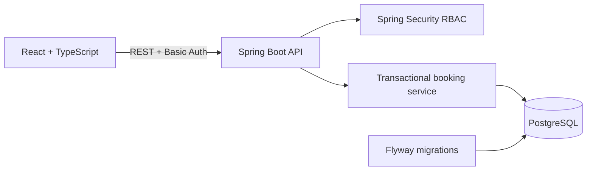
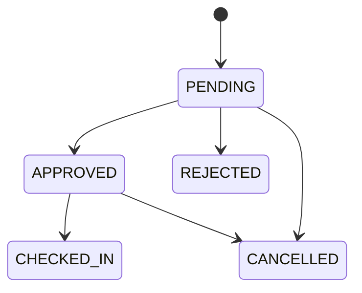

# Campus Reserve

Campus Reserve is an individual full-stack portfolio project for booking campus rooms and equipment. It demonstrates a complete vertical slice rather than a static UI: authenticated users can browse resources, submit bookings, receive conflict feedback, complete an approval workflow, and scan an approved booking's QR link to check in.

## What works

- Student and administrator demo roles protected by Spring Security.
- Active room and equipment catalogue.
- Future-dated booking requests with validation.
- Transactional overlap prevention for each resource.
- Admin approval and rejection.
- Owner/admin cancellation.
- Approved-booking QR links that open the web app, preserve the check-in intent through login, and require an authenticated confirmation.
- Flyway database migration for H2 locally and PostgreSQL in Docker.
- OpenAPI JSON and Swagger UI.
- Thirteen passing Spring Boot tests covering authentication, authorization, booking conflicts, approval, rejection, cancellation and check-in failures.
- A Playwright QR workflow test running in desktop and mobile Chromium, covering the scanned link, login and authenticated confirmation flow.
- A production React build deployed on Vercel.

## Deployment status

- Vercel frontend: <https://campus-resource-booking-eta.vercel.app>
- Spring Boot API: local only; an external Java host and PostgreSQL database are still required for the public login and booking workflow.

Vercel is intentionally used for the React application. The Java API remains a separate deployable service because Java is not an official Vercel Functions runtime. The production deployment is prepared for a Render web service backed by a Neon PostgreSQL database; `render.yaml` defines the API service and prompts separately for the PostgreSQL host, database, user and password without committing them. Set `VITE_API_URL` in Vercel to the deployed API URL ending in `/api`, then redeploy the frontend.

## Production deployment

1. Provision a Neon PostgreSQL database in the Singapore region and copy its `PGHOST`, `PGDATABASE`, `PGUSER` and `PGPASSWORD` values.
2. Create a Render Blueprint from this repository. `render.yaml` creates the free Docker web service and prompts for those database values without storing them in Git. Credentials are passed separately from the JDBC URL so startup logs cannot expose them.
3. Wait for `/actuator/health` on the Render service to return `{"status":"UP"}`. Flyway creates and seeds the schema during startup.
4. Add `VITE_API_URL=https://<render-service>.onrender.com/api` to the Vercel production environment and redeploy the frontend.
5. Verify both demo roles, booking creation, overlap rejection, admin approval and QR check-in against the public URLs.

Free Render web services can cold-start after inactivity. The database is kept separately on Neon so it does not inherit Render's 30-day free-database expiry.

## Architecture





## Run locally without Docker

Requirements: Java 21 and Node.js 22.

Terminal 1:

```bash
cd backend
./mvnw spring-boot:run
```

Terminal 2:

```bash
cd frontend
npm ci
npm run dev
```

Open `http://localhost:5173`.

Demo users:

| Role | Email | Password |
| --- | --- | --- |
| Student | `student@campus.local` | `Student123!` |
| Admin | `admin@campus.local` | `Admin123!` |

The local backend uses an in-memory H2 database in PostgreSQL compatibility mode. Swagger UI is available at `http://localhost:8080/swagger-ui.html`.

## Run the PostgreSQL stack

```bash
docker compose up --build
```

Then open `http://localhost:5173`. The database is persisted in the `campus_postgres` Docker volume.

## Verify

```bash
cd backend
./mvnw test

cd ../frontend
npm run lint
npm run build
npm run test:e2e
```

CI repeats these checks, runs the backend suite against PostgreSQL 17, and builds both Docker images.

## Engineering decisions

- A pessimistic lock serializes competing requests for the same resource before the overlap check. `@Version` provides optimistic protection when an existing booking changes state.
- Database structure is owned by a Flyway migration; Hibernate validates rather than silently changing production schema.
- Open EntityManager in View is disabled. Repository entity graphs load the resource information required by API responses.
- Credentials remain in React memory. HTTP Basic is intentionally limited to the local vertical slice and must run behind HTTPS. Before a public production launch, replace demo users with database-backed identities and secure HttpOnly session cookies or an external identity provider.
- QR codes encode an HTTPS link containing only a booking identifier and one-time-style check-in code. Scanning does not bypass authentication or owner/admin authorization, and check-in requires explicit confirmation.

## Evidence and ownership

- Project type: individual portfolio build, not team coursework.
- Engineering evidence: commit history, backend integration tests, a browser-level QR workflow test, Flyway migration, CI workflow and reproducible deployment manifests.
- Interface evidence: [QR login handoff](docs/screenshots/qr-login.png) and [authenticated QR confirmation](docs/screenshots/qr-confirmation.png), captured from the deterministic browser test fixture.
- Requirements coverage and known gaps: [`docs/requirements-traceability.md`](docs/requirements-traceability.md).
- Current limitation: no stakeholder interview or usability-test result has been claimed. That evidence must come from real sessions and should be added only after it exists.

## Next milestones

1. Replace in-memory users with database-backed accounts and password reset.
2. Expand Playwright coverage to the complete student booking and admin approval workflow.
3. Add email notifications and expiring check-in codes.
4. Run stakeholder usability sessions and record task-completion evidence.
5. Publish a live demo with seeded, non-personal data.

## Scope boundary

This project contains no AI or machine learning. It exists to demonstrate software engineering fundamentals: API design, authorization, data integrity, responsive UI, migrations, automated tests and deployment packaging.
