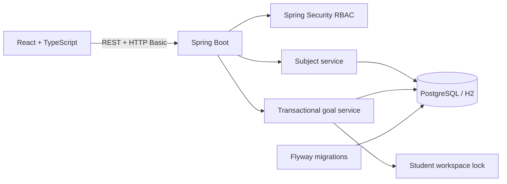
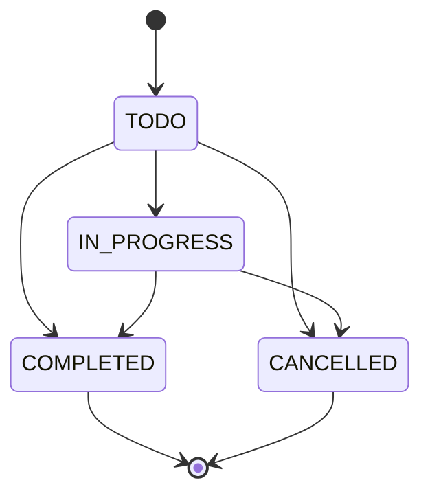

# DegreeFlow

[](https://github.com/Weisheng02/degreeflow/actions/workflows/ci.yml)

DegreeFlow is an individual, non-AI full-stack software engineering project for organising a student's degree work, FYP preparation and portfolio evidence. A student manages subjects and actionable goals; a reviewer sees only project or portfolio items that the student explicitly shares.

## Product scope

- Create, edit and archive subjects, including code, semester and colour.
- Plan assignments, study sessions, project milestones and portfolio work.
- Track priority, planned start, due date, notes and completion time.
- Move goals through controlled `TODO`, `IN_PROGRESS`, `COMPLETED` and `CANCELLED` states.
- Reject overlapping active study sessions inside a database transaction.
- Attach an HTTP/HTTPS evidence link to project and portfolio goals.
- Keep goals private by default and expose only explicitly shared evidence to the reviewer.
- Summarise active subjects, due-this-week work, in-progress and completed goals, portfolio-ready items, upcoming deadlines and overdue work.

## Demo accounts

| Role | Email | Password | Access |
| --- | --- | --- | --- |
| Student | `student@degreeflow.local` | `Student123!` | Own subjects and goals |
| Reviewer | `reviewer@degreeflow.local` | `Reviewer123!` | Shared evidence, read-only |

The accounts are fixed demonstration identities. HTTP Basic credentials are kept only in React memory and must be used over HTTPS.

## Architecture





The React client calls `/api/auth/me`, `/api/subjects` and `/api/goals`. Controllers enforce role boundaries, services enforce ownership and domain rules, and repositories persist the result. Reviewer requests are filtered to explicitly shared evidence and reviewer write routes are denied by Spring Security.

## Data integrity and security

- Every subject and goal carries an owner email. Owned lookups return `404` for another student's data rather than revealing its existence.
- Subject and goal entities use `@Version` optimistic locking.
- A study-session create or update locks the student's workspace row before checking active sessions, preventing concurrent requests from both passing the overlap check.
- Only `TODO` and `IN_PROGRESS` sessions block a time range; completed and cancelled sessions remain as history.
- Completed or cancelled goals cannot be edited or moved to another state.
- Archived subjects remain linked to historical goals but cannot receive new goals.
- Evidence URLs accept only valid `http` or `https` URLs. Only project milestone and portfolio goals can be reviewer-visible.
- Validation and domain failures use a consistent JSON error response.

## Database migration

`V1__create_booking_schema.sql` is an immutable historical migration because it already ran in Neon. It is not application functionality. `V2__create_degree_flow_schema.sql` creates the DegreeFlow tables, and `V3__remove_legacy_booking_schema.sql` removes the two obsolete tables in dependency order. The DegreeFlow application never reads or writes the historical schema.

Current application tables:

- `student_workspace`
- `study_subject`
- `degree_goal`

## Run locally

Requirements: Java 21 and Node.js 22.

Backend:

```bash
cd backend
./mvnw spring-boot:run
```

Frontend, in a second terminal:

```bash
cd frontend
npm ci
npm run dev
```

Open `http://localhost:5173`. The default profile uses an in-memory H2 database in PostgreSQL compatibility mode. Swagger UI is available at `http://localhost:8080/swagger-ui.html`.

## Run with PostgreSQL and Docker

```bash
docker compose up --build
```

Open `http://localhost:5173`. The local database uses the `degreeflow_postgres` volume.

## Verify

```bash
cd backend
./mvnw --batch-mode clean verify

cd ../frontend
npm ci
npm run lint
npm run build
npm run test:e2e
```

The backend suite covers authentication, subject lifecycle, owner isolation, reviewer restrictions, goal validation and workflow, terminal-state protection, archived subjects, evidence privacy and study-session overlap. Playwright exercises the student workflow and read-only reviewer workflow in desktop Chromium and a Pixel 7 viewport. CI repeats these checks against H2 and PostgreSQL 17, then builds both application containers.

## Deployment

- Frontend target: Vercel
- API target: Render Docker web service
- Database target: Neon PostgreSQL
- Render health endpoint: `/actuator/health`

`render.yaml` keeps database credentials as unsynchronised environment variables. The Vercel `VITE_API_URL` must point to the Render URL ending in `/api`. Public URLs and a dated online regression result will be recorded after this DegreeFlow revision is deployed and verified.

## Evidence and ownership

- Project type: individual portfolio build, not team coursework.
- Engineering evidence: Git history, Spring integration tests, Playwright workflows, Flyway migrations, CI and deployment manifests.
- Requirement mapping: [`docs/requirements-traceability.md`](docs/requirements-traceability.md).
- No stakeholder interview, usability score, internship result or employer feedback is claimed. Those results should be added only after real sessions occur.

## Current limitations

- Demo users are configured in memory; production-grade registration, password reset and persistent sessions are outside this portfolio slice.
- One demo student workspace is exposed to the reviewer. Multi-student reviewer selection is not implemented.
- Evidence is stored as a URL; file upload and object storage are not implemented.
- Notifications are in-app feedback, not email or push notifications.
- The initial version is online-first and does not provide offline synchronisation.

## Optional future enhancements

1. Database-backed identity and secure HttpOnly sessions.
2. Separate semester entities with GPA or credit tracking.
3. Calendar export and reminder notifications.
4. Evidence file upload with object storage.
5. Real stakeholder usability sessions and documented task-completion results.

## Scope boundary

DegreeFlow contains no artificial intelligence or machine learning. It demonstrates software engineering fundamentals: requirements mapping, REST API design, authorisation, ownership, validation, transactional concurrency control, optimistic locking, responsive UI, migration safety, automated testing and deployment.
